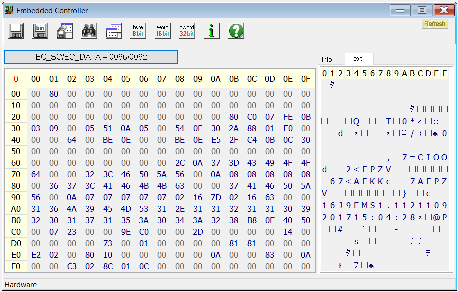

# Instructions on how to get started

- Boot up into Windows, have Dragon Center and [RW Everything](http://rweverything.com/) installed.
- Fire up RW everything and Dragon Center.
- Have them both open side by side for easy comparison
- Set your fan control to 'Advanced' in Dragon Center and open the settings for it.
- Tinker around with the curves in Dragon Center until you spot changes in RW Everything and you narrow them down to specific registers.
- For GL62M 7RDX, the CPU fan control registers are from 0x72 to 0x78.
- GPU fan control registers are from 0x8A to 0x90.
- 0x71 and 0x89 show current CPU and GPU fan speed respectively.
- 0x6A to 0x70 are CPU temperature registers, 0x82 to 0x88 are GPU temperature registers.
- RW Everything Screenshot 
- Set your preferred curve in Dragon Center and write down those values in notepad with the following format. (replace "address" and "value" with the ones you find, remove quore marks)

```text
[Temperatures_CPU]
> "address" "value"
...
...

[FanSpeeds_CPU]
> "address" "value"
...
...
[Temperatures_GPU]
> "address" "value"
...
...
[FanSpeeds_GPU]
> "address" "value"
...
...
```

- For simplicity you can just download my profile, rename it and edit the values.
- Replace the file path in the python script and run the script as root.
- Expected output will be list of values, whether the value is updated or not will be shown using '->'
- The values in output would be °C for temperature, and fan speed percentage.

```bash
[atharvalele@MSI-GL62M-manjaro MSI_Fan_Control]$ sudo python fanctrl.py
106: 55
107: 61
108: 67
109: 73
110: 79
111: 79
112: 100
114: 40 -> 0
115: 0 -> 50
116: 50 -> 60
117: 60 -> 70
118: 70 -> 80
119: 80 -> 90
120: 90 -> 86
130: 55
131: 60
132: 65
133: 70
134: 75
135: 75
136: 99
138: 0
139: 54 -> 55
140: 55 -> 65
141: 65 -> 70
142: 70 -> 80
143: 80 -> 90
144: 90
```

- **Enjoy silent computing!**