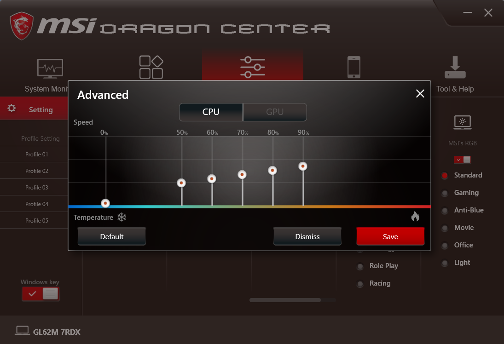
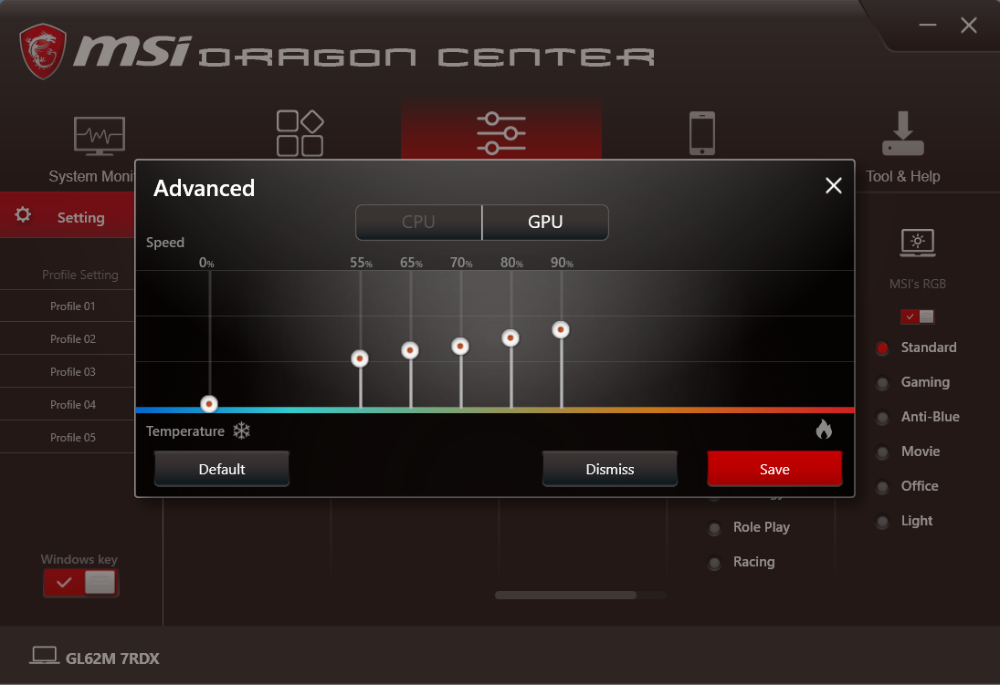

# MSI Fan Control

## Simple python script to write EC registers in Linux to control fan speed on MSI GL62M 7RDX (may or may not work on other models)

### **Requirements**

- Python 3
- root access
- Fan profile created

### **Included**

- [Instructions](Instructions.md)
- My custom fan profile for GL62M 7RDX
- Dragon Centers curves for reference (in the dragon_center_profiles folder)
- CPU Profile

- GPU Profile

### **To do**

- Add simple function to read EC values